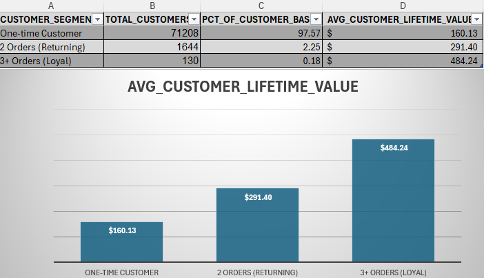

# 🛒 Olist E-Commerce End-to-End Data Analytics & BI Project

An end-to-end data analytics project analyzing the Brazilian Olist E-Commerce dataset across 100k+ orders from 2016 to 2018. This project covers data modeling, SQL cleaning, financial summary validation in Excel, and an interactive Power BI Executive Dashboard.

---

## 📌 Project Architecture & Workflow

1. **Data Cleaning & Modeling (SQL / Oracle Database):**
   - Cleaned, normalized, and transformed relational tables.
   - Handled missing values, timestamps, and localized Brazilian product categories into English.
2. **Business Summary (Excel):**
   - Pre-computed core KPI benchmarks and cross-verified revenue, order counts, and delivery metrics.
3. **Data Modeling (Power BI Star Schema):**
   - Implemented a clean Star Schema with 1-to-Many single-direction relationships to optimize query performance.
   - Generated a dedicated `Dim_Date` calendar table for full Time Intelligence support.
4. **DAX Measures & KPIs:**
   - Authored dynamic business logic stored inside an isolated `_Measures` table (Revenue, Orders, AOV, Avg Review Score, Delay Rate).
5. **Interactive Executive Dashboard:**
   - Designed a dynamic Power BI report featuring responsive visuals, cross-filtering, Top-N ranking, and categorical breakdowns.

---

## 🏗️ Data Model (Star Schema)


### Model Structure:
- **Fact Tables:** `olist_orders_dataset`, `olist_order_items_dataset`
- **Dimension Tables:** `olist_customers_dataset`, `olist_products_dataset`, `olist_sellers_dataset`, `olist_order_payments_dataset`, `olist_order_reviews_dataset`, `Dim_Date`, `product_category_name_translation`

---

## 📊 Executive Overview Dashboard


---

## 📈 Excel Business Summary



---

## ⚙️ Key DAX Measures (`POWER BI/dax_measures.txt`)

```dax
-- Total Revenue
Total Revenue = SUM(olist_order_items_dataset[price])

-- Total Unique Orders
Total Orders = DISTINCTCOUNT(olist_orders_dataset[order_id])

-- Average Order Value (AOV)
AOV = DIVIDE([Total Revenue], [Total Orders], 0)

-- Customer Satisfaction Score
Avg Review Score = AVERAGE(olist_order_reviews_dataset[review_score])

-- Delivery Delay Rate
Delay Rate = 
VAR DelayedOrders = 
    CALCULATE(
        [Total Orders],
        olist_orders_dataset[order_delivered_customer_date] > olist_orders_dataset[order_estimated_delivery_date]
    )
RETURN
DIVIDE(DelayedOrders, [Total Orders], 0)
